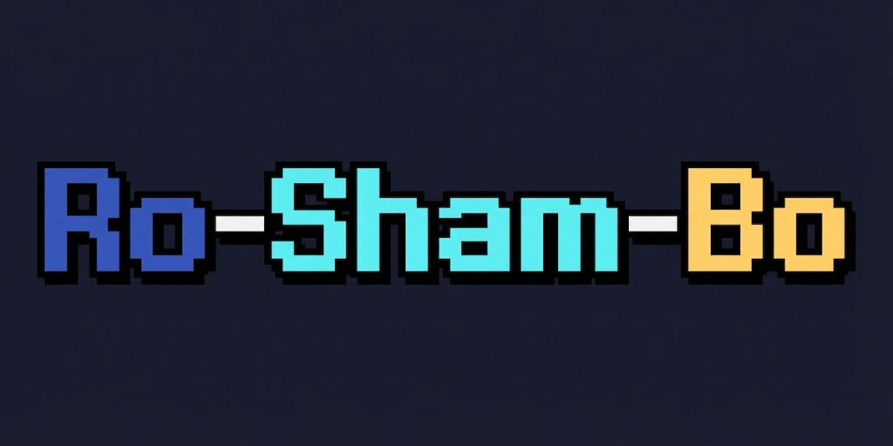

# Ro-Sham-Bo



Rock-Paper-Scissors on Solana. Bet SOL against other players, winner takes all. Built with pixel art vibes.

> **V1 has been submitted and is currently under review on the [Solana dApp Store](https://dappstore.app).**

## Overview

- **Game flow**: One player creates a game (with a 4-digit PIN), the other joins by PIN. Both submit their choice (rock / paper / scissors). When both have chosen, the winner is computed — if it's a draw, choices are cleared and a new round starts. Once a winner is decided, the backend calls the Solana program to pay out the escrowed SOL.
- **Backend**: REST API (Rust, Axum) stores games and users in **MongoDB**, authenticates players via **SIWS (Sign-In With Solana)**, and triggers on-chain **resolve** using a resolve-authority keypair.
- **On-chain**: Anchor program **rps-escrow** holds SOL in a vault PDA per game; only a designated authority can call `resolve(winner)` to send the escrowed SOL (minus 3 % fee) to the winner and close the account.

## Mobile (Solana Mobile / Seeker)

The game is played on the [**Solana Mobile**](https://solanamobile.com/developers) stack. End-to-end testing is done on the **Seeker**, Solana's reference mobile device. The mobile client connects to the same API and signs `create_game` / `join_game` transactions on-chain from the device.

## Repository structure

| Path | Description |
|------|-------------|
| `api/` | Rust API (Axum, MongoDB, Solana client for resolve) |
| `android/` | Android app (Kotlin, Jetpack Compose, Solana Mobile) |
| `programs/rps-escrow/` | Anchor workspace: Solana program `rps_escrow` |
| `programs/rps-escrow/runbooks/` | [Surfpool](https://surfpool.run) runbooks (deployment, resolve, refund) |

## Solana program (rps-escrow)

### Instructions

- **create_game(game_id, amount)** — Creator initializes the escrow PDA and deposits `amount` lamports. `game_id` is 16 bytes (UUID without hyphens, matching the MongoDB game `_id`).
- **join_game** — Second player deposits the same amount into the same PDA.
- **resolve(winner)** — Only the configured **resolve authority** can call this; it sends 3 % of the pot to the treasury, the rest to `winner` (must be creator or joiner), and closes the escrow PDA.
- **cancel** — Creator cancels the game **before** a joiner has joined; the creator's deposit is returned and the escrow PDA is closed.
- **refund** — Only the resolve authority can call this; both the creator and joiner get their deposit back (used when a game should not be resolved). Closes the escrow PDA.

### PDAs

| PDA | Seeds |
|-----|-------|
| Game escrow | `["game_escrow", creator, game_id]` |
| Vault | `["vault", game_escrow.key()]` |

### Constants

| Constant | Value |
|----------|-------|
| `RESOLVE_AUTHORITY` | `GVEseebBBBL1aykkpM2J3opBHkdGjYSdKNEdR68kfQkF` |
| `TREASURY_PUBKEY` | `Ft6kMwkButM1J7iHJBJTb8QFEBuoBPnG1jq83HMRE9mF` |
| Treasury fee | 3 % of pot on resolve |

## API

All mutating endpoints require **SIWS (Sign-In With Solana)** authentication via headers:

| Header | Description |
|--------|-------------|
| `X-SIWS-Address` | Player's wallet public key (base58) |
| `X-SIWS-Message` | SIWS message (Base64-encoded) |
| `X-SIWS-Signature` | Ed25519 signature of the message (base58) |

### Endpoints

| Method | Path | Auth | Body | Description |
|--------|------|------|------|-------------|
| `GET` | `/health` | — | — | Health check |
| `POST` | `/games/create` | SIWS | `{ "game_id": "optional-uuid", "amount_per_player": 1000000 }` | Create a game; returns `{ game_id, pin }` |
| `POST` | `/games/join` | SIWS | `{ "pin": "1234" }` | Join a waiting game by PIN; returns `{ game_id }` |
| `GET` | `/games/lookup/:pin` | — | — | Look up a waiting game by PIN (read-only) |
| `GET` | `/games/:game_id` | — | — | Get game state (creator, joiner, choices, winner, status) |
| `POST` | `/games/:game_id/choice` | SIWS | `{ "choice": "rock" \| "paper" \| "scissors" }` | Submit choice; when both have chosen, winner is computed and on-chain resolve is triggered |
| `POST` | `/games/:game_id/cancel` | SIWS | `{}` | Cancel a waiting game (creator only, before joiner joins) |

### Game statuses

`waiting` → `active` → `resolving` → `finished`

Other terminal states: `cancelled`, `resolve_failed`.

### Configuration (environment variables)

| Variable | Required | Description |
|----------|----------|-------------|
| `MONGODB_URI` | yes | MongoDB connection string |
| `MONGODB_DB_NAME` | yes | Database name |
| `SOLANA_RPC_URL` | yes | Solana RPC endpoint |
| `RPS_ESCROW_PROGRAM_ID` | yes | Deployed rps-escrow program ID |
| `RESOLVE_AUTHORITY_KEYPAIR_PATH` | yes | Path to the resolve authority keypair JSON |

## Android

### Build variants

| Variant | Application ID | Network | API |
|---|---|---|---|
| `developDebug` | com.kevred.roshambo.dev | Devnet | api.develop.rps.kevred.com |
| `developRelease` | com.kevred.roshambo.dev | Devnet | api.develop.rps.kevred.com |
| `prodDebug` | com.kevred.roshambo | Mainnet | api.rps.kevred.com |
| **`prodRelease`** | com.kevred.roshambo | Mainnet | api.rps.kevred.com |

### Run the app

1. **Open the project** — In Android Studio: **File → Open** → select the `android` folder. Wait for Gradle sync.
2. **On emulator** — Create an AVD if needed, select it and click **Run**.
3. **On Seeker** — Enable USB debugging, connect via USB, select the device and click **Run**.

### Build from command line

```bash
cd android

# Debug (develop)
./gradlew assembleDevelopDebug

# Release (prod) — signed APK for dApp Store
./gradlew assembleProdRelease
```

### Verify APK signature

```bash
apksigner verify --print-certs app/build/outputs/apk/prod/release/app-prod-release.apk
```

## Building and running

### Program (Anchor)

```bash
cd programs/rps-escrow
anchor build
anchor test
```

### API

```bash
cd api
cargo build --release
# Set MONGODB_URI, MONGODB_DB_NAME, SOLANA_RPC_URL, RPS_ESCROW_PROGRAM_ID, RESOLVE_AUTHORITY_KEYPAIR_PATH
./target/release/seeker-rps-api
```

The API listens on `0.0.0.0:3000`.

## Tech stack

- **Solana**: Anchor 0.32.1, program ID `F4d4VwBaQrqf5hUZs74XoiVCAo76BpeRSqABxMMzG7kN`.
- **API**: Rust (Axum, MongoDB driver, SIWS auth, Anchor client for resolve).
- **Mobile**: Full Kotlin (Jetpack Compose, Solana Mobile); tested on Seeker.
- **Deployment / tooling**: Surfpool (Surfnet, runbooks).

## License

ISC (see `programs/rps-escrow/package.json`).

